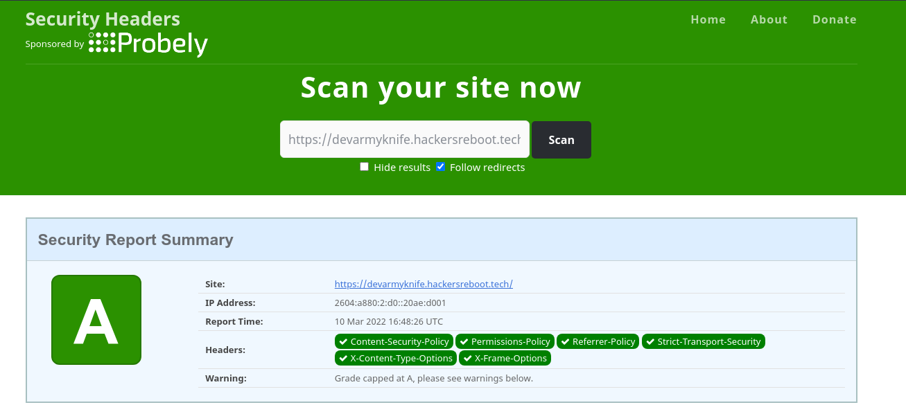

# Dev Army Knife

    

Introducing the Dev Army Knife, a toolkit for developers to do various tasks. Whether it may be generating a QR code, editing a few lines of code without the editor or joining two words without any delays and with high-quality, the Dev Army Knife is here to help you. Inspired by the Swiss Army Knife, this handy toolkit includes many useful tools for developers to use in day-to-day tasks.


## Getting Started
Just log over [here](https://devarmyknife.hackersreboot.tech/). There you will find two options.    
1. Go to Tools
2. DevTools Wiki
## Run Locally

Clone the project

```bash
  git clone https://github.com/Arpan-206/DevArmyKnife.git
```

Go to the project directory

```bash
  cd DevArmyKnife
```

Install dependencies

```bash
  yarn install
```

Start the server

```bash
  yarn run dev
```

Build for production.

```bash
  yarn run build
  yarn run start 
```

## Features

- 🕴️ Tailored to Devs
- 🕶️ Dark Mode
- ⚡ Fast
- 📱 Mobile Friendly
- 💻 Self Hostable
- 🔐 Secure
- PWA Support    

View in detail over [here](https://dakdocs.hackersreboot.tech/#features).

## License

[MIT](https://choosealicense.com/licenses/mit/)


## Documentation
Please visit our documentation over at [dakdocs.hackersreboot.tech](https://dakdocs.hackersreboot.tech/).
(😉 I may be flexing but it is beautiful lol)


## Tech Stack

**Client:** React, TailwindCSS, NextJS

**Server:** Node, NextJS, Netlify(for Deployment)

## PWA Support
We now have in-built PWA Support. For those of you who don't know, it means that the toolkit can now incorporate many features of a native app and you can install it to use even if you are offline.

## Security
We have tried to provide you with the best security we can. Here, is the security check from [Security Headers](https://securityheaders.com/?q=https%3A%2F%2Fdevarmyknife.hackersreboot.tech%2F&followRedirects=on).


## Contributing

Contributions are always welcome!

See `contributing.md` for ways to get started.

Please adhere to this project's `code of conduct`.


## FAQ

#### Do you keep any of my data?

No, we don't keep any data of any sorts. In most of the tools the processing is done in the browser itself only where it is not technically possible do we do the processing on the server side.

#### Is it really free?

Yes, it is completely free. We don't have any trackers from our side. We only rely on your support end to continue this project.


## Acknowledgements

 - [NextJS](https://nextjs.org/)
 - [Netlify](https://netlify.com/)
 - [Retype](https://retype.com/)

<a href="https://www.netlify.com">
  
</a>        

The deployments of this project and its documentation is managed by the good folks over at [Netlify](https://netlify.com).

## Latest Build Status

[](https://app.netlify.com/sites/devarmyknife/deploys)

## Author

[@Arpan-206](https://www.github.com/Arpan-206)

